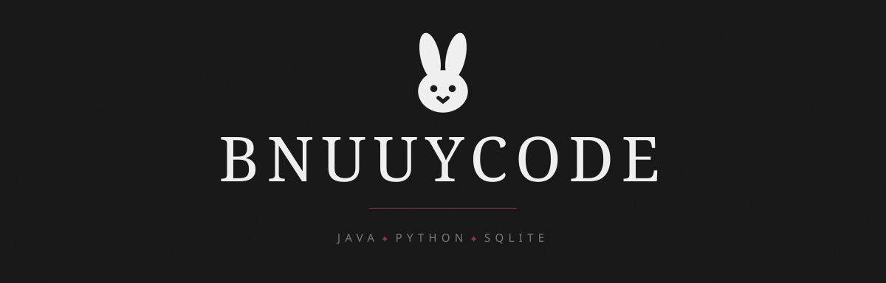
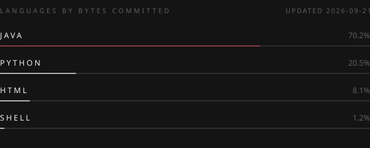

 

I write tools so the parts I don't like do themselves.

Java on the back end, Python for anything visual, and one rule I don't bend:
**a number on screen has to say how fresh it is.** A failed fetch shows *stale*.
Never yesterday's value dressed up as today's.

 

## Working on

**[stream-metrics](https://github.com/bnuuyCode/stream-metrics)** — a self-hosted metrics
aggregator. Current values are fetched live on demand and cached for 60 seconds; SQLite holds
only daily snapshots, and those feed only the history charts. Collectors go in one platform
at a time.

`Java 21` ✦ `Javalin` ✦ `SQLite` ✦ `JDBI3` ✦ `Flyway` ✦ `Jackson` ✦ `Maven` ✦ `Chart.js`

## Finished

**[chiwavisualkit](https://github.com/bnuuyCode/chiwavisualkit)** — a full visual identity
written as code. Seven full-screen states, twelve emotes, six tier badges, thirteen reward
icons, one seal. Every piece is HTML/CSS or PIL geometry rendered to PNG — no graphics editor,
no image generator, nothing bought and nothing copied.

`Python` ✦ `Playwright` ✦ `Pillow` ✦ `SVG` ✦ `HTML` ✦ `CSS`

**[ImageUtilities](https://github.com/bnuuyCode/ImageUtilities)** — the small scripts I actually
run every week. Resize by dimension or by file size, convert between formats into date-named
folders, match a folder of product photos against a spreadsheet.

`Python` ✦ `Pillow` ✦ `Excel`

 

## What I actually write

 

---

the header and the language card are SVGs, built by <a href="assets/build-banner.sh"><code>build-banner.sh</code></a> and <a href="assets/build-languages.sh"><code>build-languages.sh</code></a>.
 
the bnuuy in it is emote geometry from <a href="https://github.com/bnuuyCode/chiwavisualkit">chiwavisualkit</a>, coordinate for coordinate — nothing redrawn.

